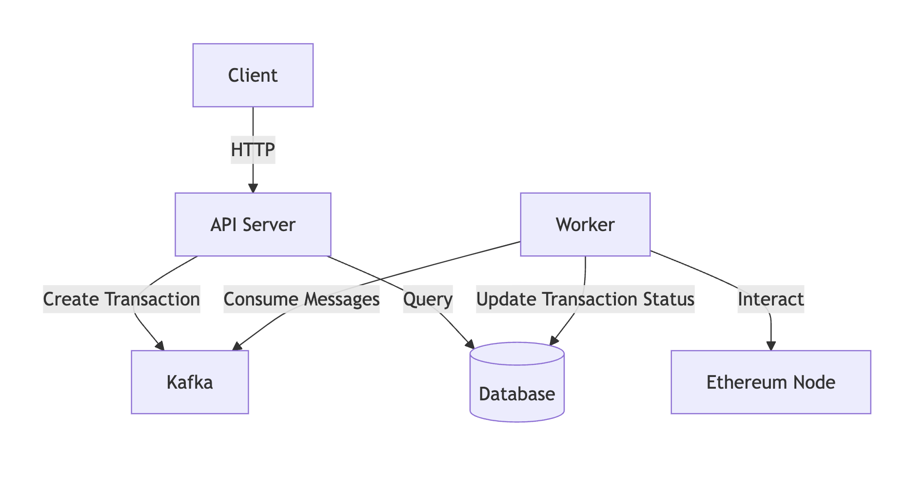

# MPC Wallet Backend Service

This project provides a backend service for a Multi-Party Computation (MPC) wallet, offering secure key management and transaction signing capabilities.

## Features

- Secure MPC-based key generation and management
- Transaction signing using MPC
- RESTful API for wallet operations
- Kafka integration for asynchronous transaction processing
- Docker support for easy deployment

## Prerequisites

- Go 1.21 or higher
- Docker and Docker Compose
- Make (optional, for using Makefile commands)

### System Architecture



This system contains two main components:

- `api`: RESTful API for wallet operations
- `worker`: Kafka consumer to process transaction receipts

## Project Structure

```
mpcoin/
├── cmd/
│   ├── api/
│   │   └── main.go
│   └── worker/
│       └── main.go
├── internal/
│   ├── config/
│   ├── delivery/
│   │   └── http/
│   ├── domain/
│   ├── infrastructure/
│   │   ├── db/
│   │   ├── ethereum/
│   │   └── kafka/
│   ├── repository/
│   │   └── postgres/
│   └── usecase/
├── docs/
│   └── swagger/
├── scripts/
├── .env.example
├── docker-compose.yml
├── docker-compose.kafka.yml
├── Dockerfile
├── go.mod
├── go.sum
└── README.md
```

## Installation

1. Clone the repository:

   ```
   git clone https://github.com/vietddude/mpcoin.git
   cd mpcoin
   ```

2. Install dependencies:

   ```
   go mod download
   ```

3. Set up environment variables:
   ```
   cp .env.example .env
   ```
   Edit the `.env` file with your configuration.

## Usage

### Running Locally with Docker

1. Start the Kafka and PostgreSQL services:

   ```
   docker-compose -f docker-compose.kafka.yml up -d
   ```

2. Build and run the API server:

   ```
   go run cmd/api/main.go
   ```

3. In a separate terminal, run the worker:
   ```
   go run cmd/worker/main.go
   ```

The API will be available at `http://localhost:8080`.

### Using Make Commands

If you have Make installed, you can use the following commands:

- Start all services: `make up`
- Stop all services: `make down`
- Run API server: `make run-api`
- Run worker: `make run-worker`
- Run tests: `make test`

### API Documentation

Swagger UI is available at `http://localhost:8080/docs` when the API server is running.

## Development

### Adding New API Endpoints

1. Define the route in `internal/delivery/http/router.go`
2. Implement the handler in `internal/delivery/http/handlers/`
3. Update the Swagger documentation in `docs/swagger/`

### Modifying Database Schema

1. Update the schema in `internal/infrastructure/db/migrations/`
2. Run migrations: `make migrate-up`
3. Update SQLC queries in `internal/infrastructure/db/queries/`
4. Generate new SQLC code: `make sqlc`

## Testing

Run unit tests:

```
go test ./...
```

For integration tests:

```
make integration-test
```

## Security Considerations

- Ensure proper key management practices are followed
- Regularly update dependencies
- Use secure communication channels (HTTPS, SSL/TLS)
- Implement proper authentication and authorization mechanisms

## Contributing

Contributions are welcome! Please follow these steps:

1. Fork the repository
2. Create a new branch: `git checkout -b feature-branch-name`
3. Make your changes and commit them: `git commit -m 'Add some feature'`
4. Push to the branch: `git push origin feature-branch-name`
5. Submit a pull request

## License

This project is licensed under the MIT License - see the [LICENSE](LICENSE) file for details.
